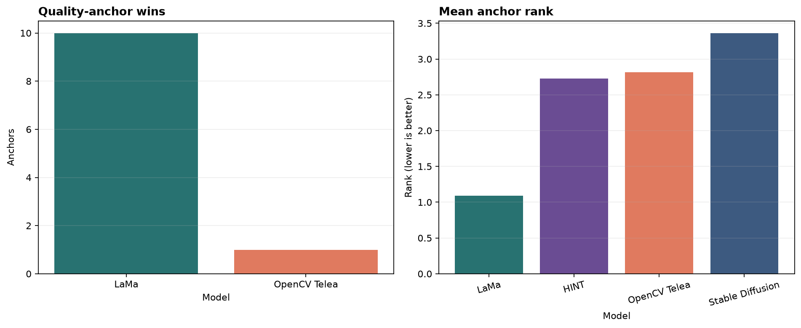

# Trustworthy Evaluation Frameworks for AI-Assisted Painting Restoration

A master's thesis project investigating how to evaluate painting restorations beyond visual appearance or a single image-similarity score.

The framework combines controlled artificial damage, pretrained inpainting models, region-aware metrics, uncertainty maps, robustness experiments, and explainable case-level evidence.

> **Visual plausibility is not the same as restoration trustworthiness.**

[Explore the dashboard](https://fhtw-painting-restoration.streamlit.app/) · [Full evaluation report — HTML](https://github.com/Rahul-DS25M008/painting_restoration_eval/blob/main/outputs/33_final_evaluation_report/reports/final_evaluation.html) · [Case and painting reports — HTML](https://github.com/Rahul-DS25M008/painting_restoration_eval/blob/main/outputs/32_case_and_painting_report_generation/reports/index.html)

**Status:** The 36-notebook core computational pipeline and the post-pipeline Notebook 37 method-selection extension are complete. The interactive dashboard is publicly deployed.

For interactive inspection, open the dashboard. For standalone reports, download the HTML file and open it in a browser; its presentation images are embedded.

## What does the study show?

**LaMa is the strongest general baseline in this controlled benchmark**, ranking first on **10 of 11 quality anchors**. OpenCV Telea leads the remaining anchor—crop SSIM—and provides the fastest baseline.

A *quality anchor* is a specific metric evaluated in a defined image region. Anchor wins summarize agreement across these separate comparisons; they are not a combined restoration-quality score.



*Left: how many quality anchors each model leads. Right: average rank across the anchors, where lower is better. SDXL is excluded from this full-benchmark ranking.*

| Method | Main result | Practical interpretation |
|---|---|---|
| **LaMa** | Leads 10 of 11 anchors | Strongest starting point among the evaluated methods when several aspects of restoration quality matter. |
| **OpenCV Telea** | Leads crop SSIM; median recorded runtime **0.424 s** | Useful for fast, deterministic filling, but its SSIM advantage does not translate into the strongest overall result. |
| **Stable Diffusion Inpainting** | Leads none of the 11 aggregate anchors | Candidate diversity requires closer inspection of reference fidelity, local consistency, and repeated-seed variation. |
| **SDXL Inpainting** | Ten completed feasibility cases | Supports bounded inspection, not a fourth full-benchmark ranking. |

These findings apply to the tested collection and experimental settings—not to every painting, damage condition, or conservation task.

**Model reports (HTML):** [LaMa](https://github.com/Rahul-DS25M008/painting_restoration_eval/blob/main/outputs/31_model_report_generation/reports/lama.html) · [Telea](https://github.com/Rahul-DS25M008/painting_restoration_eval/blob/main/outputs/31_model_report_generation/reports/opencv_telea.html) · [Stable Diffusion](https://github.com/Rahul-DS25M008/painting_restoration_eval/blob/main/outputs/31_model_report_generation/reports/stable_diffusion_inpainting.html) · [SDXL](https://github.com/Rahul-DS25M008/painting_restoration_eval/blob/main/outputs/31_model_report_generation/reports/sdxl_inpainting.html)

### Why HINT was selected for the next expansion

The completed benchmark intentionally contains different method families: Telea is classical and deterministic, LaMa is learned and deterministic, and Stable Diffusion is stochastic and prompt-conditioned. Notebook 37 tested **HINT** and **MAT** because the planned 300-painting expansion would benefit from a second deterministic learned architecture with an explicit mask-aware transformer design and stronger long-range context modelling.

Both candidates passed the technical hard gates on the same 12 canonical cases, but HINT provided the clearer expansion path:

- **HINT led 96 of 108 case-level metric anchors**; MAT led 6 and 6 were ties.
- HINT ran at the native **768 × 768** evaluation resolution. MAT required a declared **512 × 512** adapter before returning to the 768 canvas.
- HINT's mean recorded inference time was **8.26 s per case**, compared with **10.00 s** for MAT. HINT used more peak GPU memory (**5.06 GiB** versus **1.23 GiB**), but remained feasible on the tested hardware.
- Complete visual review found that MAT often retained thin scratches and produced pale or fragmented large-loss completions. HINT was more consistent across the paired scope.
- HINT's MIT-licensed implementation is better suited to later reuse than MAT's noncommercial research license.

HINT is therefore the selected additional method for the future expanded benchmark. This **24-candidate selection pilot is not merged into the frozen three-method leaderboard** and does not establish full painting-domain superiority.

[HINT–MAT selection report](https://github.com/Rahul-DS25M008/painting_restoration_eval/blob/main/outputs/37_hint_mat_method_selection/reports/method_selection_report.html) · [Recorded selection decision](https://github.com/Rahul-DS25M008/painting_restoration_eval/blob/main/outputs/37_hint_mat_method_selection/reports/selection_decision.json)

## Research questions

1. How can a multi-metric evaluation framework be designed to assess AI-generated painting restorations beyond traditional image similarity metrics?
2. How do selected inpainting methods differ in restoration quality across broad visual categories and controlled artificial damage conditions?
3. To what extent can uncertainty estimation from multiple restoration candidates identify speculative or unreliable restored regions?

The contribution is an **evaluation framework**, not a newly trained restoration model or an automated conservation system.

For the study design, evaluation choices, and interpretation boundaries, see the [methodology guide](docs/methodology_notes.md). The [literature reference log](docs/literature_reference_log.md) connects the framework to its research sources and explains what each reference supports and where its relevance is limited.

## Dataset and experiments

The controlled collection contains **50 paintings**, balanced across five broad visual categories: portrait/figure, landscape/natural, architecture/structured, abstraction/surrealism, and high-texture/brushwork.

Clean reference images allow artificial damage to be introduced and restoration outputs to be compared against known image content.

| Experiment | Coverage | Purpose and evidence |
|---|---|---|
| **Canonical damage** | 250 cases: four damage types and one undamaged control per painting | Compare thin scratches, small losses, large losses, and mixed damage. [Model comparison](https://github.com/Rahul-DS25M008/painting_restoration_eval/blob/main/outputs/21_multi_model_comparison/reports/multi_model_comparison.html) |
| **Damage-size sensitivity** | 35 cases across five paintings; target areas of 2%, 4%, 6%, 8%, 10%, 15%, and 20% | Examine how restoration changes as the missing area grows. [Analysis](https://github.com/Rahul-DS25M008/painting_restoration_eval/blob/main/outputs/23_damage_size_sensitivity_analysis/reports/damage_size_analysis.html) |
| **Mask robustness** | 75 cases across five paintings | Test sensitivity to controlled changes in mask geometry. [Analysis](https://github.com/Rahul-DS25M008/painting_restoration_eval/blob/main/outputs/24_mask_robustness_analysis/reports/mask_robustness_analysis.html) |
| **Synthetic degradation** | 165 cases spanning 13 individual and combined families | Examine effects such as stains, dirt, fading, and blur, with restoration comparisons restricted to eligible conditions. [Analysis](https://github.com/Rahul-DS25M008/painting_restoration_eval/blob/main/outputs/25_synthetic_degradation_analysis/reports/synthetic_degradation_analysis.html) |

Together, these produce **525 registered cases**, of which **410 enter the restoration evidence population**. The frozen core catalog contains **1,785 retained candidates**, including repeated-seed and prompt-ablation evidence. Notebook 37 adds a separate 24-candidate HINT–MAT selection pilot without changing that catalog.

The retained catalog defines the analysis population, not a quality-approval list. The 410 cases include 50 undamaged controls, which support validation; core restoration-quality comparisons use the 360 nonzero-damage cases.

Cases, candidates, and independent paintings are different quantities. Repeated outputs from one painting do not increase the number of independent paintings.

## How restoration quality is evaluated

The framework keeps complementary evidence separate:

- **Reference fidelity:** pixel error, PSNR, and SSIM.
- **Perceptual and feature similarity:** LPIPS, CLIP, and DINOv2.
- **Local consistency:** texture, brushstroke-direction proxies, colour differences, and boundary/seam diagnostics.
- **Spatial and structural evidence:** difference maps, semantic/structural affinity, overlays, and crops.
- **Uncertainty and explainability:** repeated-seed variability, heatmaps, computational flags, counterfactual evidence, and similar-case retrieval.

Metrics use regions appropriate to their definitions, including the damaged region, bounding-box crop, boundary ring, and surrounding content. This prevents unchanged background pixels from obscuring local restoration errors.

**Why this matters:** Telea's crop-SSIM lead and LaMa's broader advantage show that metric choice can change the apparent winner. A single leaderboard score would conceal that disagreement.

[Evaluation contract](https://github.com/Rahul-DS25M008/painting_restoration_eval/blob/main/outputs/08_experiment_contracts_and_region_policy/reports/evaluation_contract.md) · [Metric and region ablation](https://github.com/Rahul-DS25M008/painting_restoration_eval/blob/main/outputs/28_metric_and_region_policy_ablation/reports/ablation_study.html) · [Grouped statistical analysis](https://github.com/Rahul-DS25M008/painting_restoration_eval/blob/main/outputs/26_grouped_and_statistical_analysis/reports/statistical_analysis.html)

## Uncertainty, prompts, and human review

Stable Diffusion uncertainty covers **165 four-seed groups**: 130 original prompt-specific groups and 35 damage-size groups. Spatial maps reveal where repeated candidates disagree.

A controlled thin-scratch prompt ablation compares generic and damage-aware prompting. Prompt variants remain separate within uncertainty groups so prompt changes are not mistaken for seed variation.

**Higher variability identifies areas deserving closer inspection; lower variability does not establish correctness.** Deterministic methods are assessed through robustness and sensitivity rather than artificial seed-based uncertainty.

Conservative computational rules flag **1,703 of 1,785 candidates** for review. This is **not a 95.4% objective failure rate**: the flags organize inspection and do not replace expert judgement.

[Prompt policy](https://github.com/Rahul-DS25M008/painting_restoration_eval/blob/main/outputs/11_stable_diffusion_restoration/reports/prompt_policy.md) · [Flag definitions](https://github.com/Rahul-DS25M008/painting_restoration_eval/blob/main/outputs/27_failure_taxonomy_and_trustworthiness_flags/reports/flag_definitions.html) · [Explanation catalog](https://github.com/Rahul-DS25M008/painting_restoration_eval/blob/main/outputs/29_explainable_ai_and_case_retrieval/reports/explanation_catalog.html)

## Explore the evidence

The [Streamlit dashboard](https://fhtw-painting-restoration.streamlit.app/) provides eight views:

**Overview · Study Design · Metric Framework · Model Performance · Robustness & Uncertainty · Trustworthiness & XAI · Case Explorer · Reports & Reproducibility**

Compare original, damaged, and restored images alongside diagnostic maps and exact numerical measurements. Case Explorer supports model, metric, region, seed, and prompt filtering, with damaged values, restored values, improvement, applicability, and CSV downloads. Model Performance also exposes the numerical estimates and intervals behind its aggregate plots.

Measurements are shown only where they were computed. Additional damage-size seed candidates retain their uncertainty evidence without inheriting the reference-quality scores of another candidate.

The dashboard reads existing evidence; it does not run restoration models or recompute scientific metrics.

Reports show selected examples for readability. The complete retained candidate catalog and indexed visual evidence remain available separately. Detailed reports cover **30 selected cases and all 50 paintings**.

**Reading HTML reports:** Repository links open the report files on GitHub. Download an HTML report and open it locally to view its embedded figures and images, or access it through the dashboard.

## Run locally and reproduce

For dashboard use, install **Python 3.12** and **Git LFS**, then:

```powershell
git lfs install
git clone https://github.com/Rahul-DS25M008/painting_restoration_eval.git
cd painting_restoration_eval
git lfs pull

py -3.12 -m venv .venv
.\.venv\Scripts\Activate.ps1
python -m pip install -r requirements.txt
python -m streamlit run streamlit_app.py
```

The dashboard does not require a GPU. Full experimental reproduction uses a separate environment and additional model/data prerequisites; see the [reproducibility appendix](https://github.com/Rahul-DS25M008/painting_restoration_eval/blob/main/outputs/36_supervisor_publication_reproducibility_package/reports/reproducibility_appendix.md).

Repository navigation:

- `notebooks/` — the completed 36-stage core pipeline plus the separate Notebook 37 method-selection extension; see the [notebook roadmap](https://github.com/Rahul-DS25M008/painting_restoration_eval/blob/main/docs/final_notebook_roadmap.md).
- `src/restoration_eval/` — reusable implementation modules.
- `config/` — versioned experiment and evaluation contracts.
- `outputs/<notebook_name>/` — notebook-owned evidence, reports, and validation.
- `outputs/inventory/` — global file inventory and artifact registry.

The [review package](https://github.com/Rahul-DS25M008/painting_restoration_eval/blob/main/outputs/36_supervisor_publication_reproducibility_package/package/README.md) bundles reports, final figures, compact tables, model cards, and provenance. It is not a complete executable copy of the repository.

## Interpretation limits

The study uses controlled synthetic damage, not verified physical conservation treatments. Broad visual categories are not independently established art-historical style effects; the focused five-painting experiments support within-study sensitivity analysis.

Uncertainty is not calibrated confidence, computational flags are not expert annotations, and feature similarity is not historical authenticity. SDXL remains a bounded feasibility study. Notebook 37 is a 12-case method-selection pilot; HINT has not yet been run as a fourth full-benchmark method.

**Overall conclusion:** restoration evaluation should combine regional fidelity, perceptual and local consistency, variability, and inspectable case evidence. The framework supports better-informed review—not automatic conservation approval.
