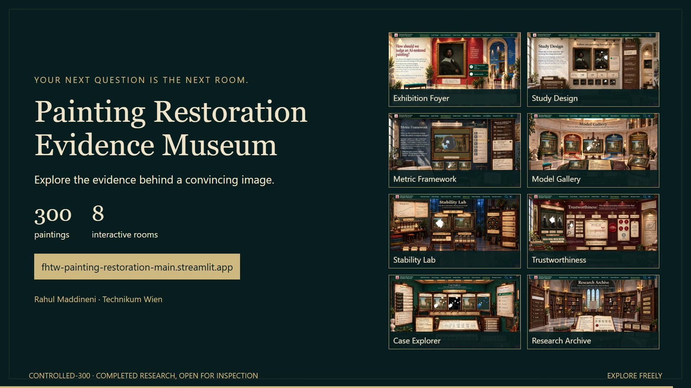

# Trustworthy Evaluation Frameworks for AI-Assisted Painting Restoration

[](https://fhtw-painting-restoration-main.streamlit.app/?room=exhibition_foyer&tour=1)

**[▶ Watch the museum tour · 1:55](https://fhtw-painting-restoration-main.streamlit.app/?room=exhibition_foyer&tour=1)** — A short introduction to the eight-room research dashboard. Click the preview, then Play in **Tour Overview**; fullscreen is available. Switch to **Explore Rooms** for the original self-paced guided route.

**A restoration can look convincing and still be wrong. How should we evaluate it?**

This master's thesis develops and applies an evidence-based evaluation framework for AI-assisted painting restoration. It combines controlled artificial damage, complementary inpainting methods, region-aware measurements, robustness experiments, repeated-candidate disagreement and inspectable case-level evidence.

The contribution is an **evaluation framework and reproducible empirical study**, not a newly trained restoration model or an automated conservation system.

[Explore the dashboard](https://fhtw-painting-restoration-main.streamlit.app/) · [Learn the pipeline](https://rahul-ds25m008.github.io/painting_restoration_eval/) · [Research archive / DOI](https://doi.org/10.5281/zenodo.23092185) · [Final evaluation report](outputs/33_final_evaluation_report/reports/final_evaluation.html) · [Supervisor walkthrough](docs/supervisor/Supervisor_Dashboard_Walkthrough_Controlled_300.pdf) · [Completion and review brief](docs/supervisor/Study_Completion_and_Review_Brief.pdf)

> Visual plausibility, metric performance and output stability are different kinds of evidence. None alone establishes historical correctness or conservation approval.

## The study in one minute

The completed **Controlled-300** study uses 300 paintings, balanced across five broad visual categories. Artificial damage creates known-reference comparisons: the original image is available, so a restoration can be inspected against the content it was meant to recover.

Four methods have full eligible-case coverage: **OpenCV Telea, LaMa, HINT and Stable Diffusion**. SDXL is reported separately as a bounded feasibility branch.

The main comparative finding is clear: **LaMa has the lowest mean masked MAE (14.83) and crop LPIPS (0.1292); Telea leads crop SSIM (0.8632)** across the 2,320 paired nonzero-damage cases. LaMa leads **10 of 11 saved quality anchors, corresponding to nine wins among ten distinct scalar quantities**: masked MAE and mean masked spatial error summarize the same scalar error, although the spatial maps add localization. Distinct quantities can still be correlated; these are not independent votes. Zero anchor wins do not mean a method never performs well on an individual painting.


The framework preserves disagreement between measurements and connects aggregate results to exact candidates, diagnostic maps, limitations and source records. The [final supervisor synthesis](outputs/36_supervisor_publication_reproducibility_package/reports/supervisor_summary.md) pairs the principal claims with their evidence and limits.

## Research questions and final answers

### RQ1 — What does richer evaluation reveal?

**What additional evidence does a region-aware, multi-metric evaluation framework provide beyond traditional image-similarity metrics when evaluating AI-assisted painting restoration?**

**The framework reveals perceptual, semantic, colour, texture, seam and structural differences that pixel error and SSIM alone do not capture.** It adds LPIPS, CLIP and DINOv2 similarity, local feature correspondence, CIEDE2000 colour error, texture-error maps, boundary-gradient mismatch and structural-affinity diagnostics. Measuring the missing region, its bounding-box crop, the repair boundary and surrounding content separately also identifies where a restoration improves the damaged input and where it introduces new error.

The results demonstrate why this additional evidence changes the conclusion. In the overall nonzero-damage comparison, **Telea has the highest mean crop SSIM (0.8632 versus LaMa's 0.8577), but LaMa has substantially lower crop LPIPS (0.1292 versus 0.2007), lower masked colour error (6.88 versus 7.77) and higher crop DINOv2 similarity (0.8712 versus 0.6870)**. Stable Diffusion ranks second on crop CLIP and DINOv2 similarity, yet has the highest masked pixel and colour errors among the four full-coverage methods. The richer evaluation therefore separates structural resemblance, perceptual fidelity, feature similarity and local repair consistency instead of treating them as equivalent outcomes.

[Metric disagreement](outputs/21_multi_model_comparison/reports/multi_model_comparison.html) · [Metric/region ablation](outputs/28_metric_and_region_policy_ablation/reports/ablation_study.html)

[Three traceable examples](docs/framework_evidence_chain.md) show the contribution directly: a classical-only LaMa/Telea tie separates under the richer policy; Telea's SSIM-leading `p009` small-loss restoration ranks last on LPIPS; and LaMa's `p002` large-loss restoration leads both, leaving the conclusion unchanged.

### RQ2 — How do the methods compare?

**How do selected inpainting methods differ in restoration quality across controlled artificial damage conditions, and how consistent are these differences across the evaluated paintings?**

**LaMa is the strongest overall evaluated pipeline in Controlled-300; Telea leads crop SSIM.** Across the 2,320 paired nonzero-damage cases, mean masked MAE is **14.83 for LaMa, 17.57 for Telea, 19.16 for HINT and 30.61 for Stable Diffusion**. HINT ranks second on crop LPIPS and local DINO correspondence, while Stable Diffusion ranks second on crop CLIP and DINOv2 similarity. The canonical painting-level analysis confirms differences between the four methods on all 11 saved anchors (1,200 canonical cases reduced to four-case medians for each of 300 equally weighted paintings; Friedman tests, all adjusted *q* < 10⁻¹³⁴), with Kendall's W from 0.69 to 0.82. The anchors include overlapping measurements, not 11 independent confirmations.

The controlled stress tests also favour LaMa on pixel fidelity and placement stability. Across 35 paintings and seven damage levels from 2% to 20%, the median increase in masked MAE per ten percentage points of damage is **3.43 for LaMa, 4.68 for Telea, 5.20 for Stable Diffusion and 5.92 for HINT**. Across the 35-painting mask-placement experiment, the median within-painting/family MAE dispersion (MAD) is **0.92 for LaMa versus 2.35 for Stable Diffusion**; crop-LPIPS dispersion is **0.0037 versus 0.0159**, respectively. Thus, LaMa combines the strongest aggregate fidelity with comparatively low sensitivity to increased loss and changed mask placement, while the other methods' advantages are more metric-specific.

[Model comparison](outputs/21_multi_model_comparison/reports/multi_model_comparison.html) · [Grouped statistical analysis](outputs/26_grouped_and_statistical_analysis/reports/statistical_analysis.html)

### RQ3 — What does repeated-output disagreement tell us?

**How can repeated-candidate disagreement be used to characterize the stability of stochastic painting restorations, and how does it relate to other restoration-quality diagnostics?**

**Repeated-candidate disagreement identifies both the amount and location of stochastic instability, and higher disagreement is associated with poorer restoration fidelity.** The study evaluates **1,025 four-seed Stable Diffusion groups**: 780 canonical prompt-specific groups and 245 damage-size groups. Each group provides six pairwise comparisons, supplemented by pixelwise variability maps. RGB dispersion measures changes in reconstructed colour and pixels; pairwise LPIPS, CLIP and DINOv2 distances measure changes in perceptual and feature content while keeping the case and prompt fixed.

The painting-level canonical analysis quantifies the relationship to quality. For the generic prompt, **masked RGB variability correlates with masked reconstruction MAE at Spearman ρ = 0.513, while crop pairwise LPIPS correlates with reference-based crop LPIPS error at ρ = 0.586**. For the scratch-aware prompt, these associations rise to **0.622 and 0.713**, respectively (300 paintings per prompt; all four adjusted *q* < 10⁻²⁰). The correspondence is diagnostic-specific: generic-prompt LPIPS disagreement is associated with perceptual error but not masked MAE (ρ = −0.020, *q* = 0.731). Repeated outputs therefore add a distinct stability signal, with pixel variability tracking pixel error and perceptual variability tracking perceptual error most clearly.

[Saved RQ answers and source-row identities](outputs/36_supervisor_publication_reproducibility_package/data/key_findings.json) · [Final evidence tables](outputs/33_final_evaluation_report/data/thesis_tables.csv)

## What was evaluated?

| Population | Completed scope | Meaning |
|---|---:|---|
| Paintings | 300 | 60 in each of five broad visual categories |
| Registered cases | 3,425 | Includes conditions not treated as inpainting |
| Restoration-eligible cases | 2,620 | 2,320 nonzero-damage cases plus 300 identity controls |
| Matched primary candidates | 10,480 | Four full methods across the eligible cases |
| Retained report candidates | 13,879 | Primary, repeated-seed, prompt and bounded SDXL evidence; not all execution records |
| Supported uncertainty groups | 1,025 | Four seeds per group, not 1,025 independent paintings |
| SDXL branch | 24 completed / 35 scheduled | Partial feasibility evidence, not a fifth full-coverage method |

The five categories are portrait/figure, landscape/natural, architecture/structured, abstraction/surrealism and high-texture/brushwork. They are operational visual groupings, not independently verified style labels.

Category balance is not cultural, geographic, chronological or conservation-condition representativeness. Three source institutions supply 208/300 paintings (69.3%), and style/period metadata is missing for 32. Artificial damage enables controlled reference comparisons rather than demonstrating generality to real conservation conditions. SDXL's 35-case schedule covers 30 paintings; its 24 technically validated completions cover 19, with one timeout and ten not started after the guard.

| Experiment | Registered cases | Design |
|---|---:|---|
| Canonical damage | 1,500 | 300 paintings × four damage types and one undamaged control |
| Damage-size sensitivity | 245 | 35 paintings × seven target damage levels, from 2% to 20% |
| Mask robustness | 525 | 35 paintings × 15 controlled mask conditions |
| Synthetic degradation | 1,155 | 35 paintings × 33 conditions; only eligible effects enter restoration comparisons |

The retained catalogue is an analysis population, **not a quality-approval list**. Missing measurements remain missing; a candidate never inherits another candidate's score. Detailed design and independence rules are in the [methodology notes](docs/methodology_notes.md).

The comparison concerns **fixed pipelines**, not architecture alone: Stable Diffusion uses 512×512 inference before returning to the 768×768 canvas, while Telea, LaMa and HINT operate at 768×768. Resizing, mask handling, prompting and generation settings may contribute to the differences. Overall metric means are **case-weighted summaries of the benchmark mixture**, distinct from the painting-level statistical analyses.

**Reading the frozen reports:** ten N21 overall anchors use 2,320 nonzero cases; structural-affinity correlation uses 2,620 cases including controls. The [post-publication errata and corrected exports](docs/errata/2026-10-03/README.md) correct T04/T05 population labels, distinguish T10's canonical tests from its all-branch runtime associations, and clarify SDXL coverage. Original N26/N33/N36 and Zenodo files remain historical snapshots. Saved metric values and statistical results are unchanged. Read the frozen reports together with these corrections.

### Model training data and possible artwork overlap

The study evaluated existing pretrained checkpoints; it did **not train or fine-tune the restoration models on Controlled-300**. Telea is the exception to the pretrained-model description: it is a non-learned algorithm. The following distinguishes the actual checkpoints used from other models released by the same authors; identifiers and revisions are recorded in the [experiment configurations](config/experiments/).

| Method used | Documented training source | Relevance to paintings |
|---|---|---|
| **OpenCV Telea** (`cv2.INPAINT_TELEA`) | **No training dataset.** Fast-marching inpainting propagates information from the visible neighbourhood. [OpenCV documentation](https://docs.opencv.org/4.x/df/d3d/tutorial_py_inpainting.html). | Training-set overlap is not applicable. |
| **LaMa** (`big-lama.pt`, through IOPaint) | Big-LaMa uses **Places / Places365-Challenge**, a photographic scene dataset, rather than a dedicated painting-restoration corpus. [Author repository](https://github.com/advimman/lama#places-challenge), [Places dataset](https://places2.csail.mit.edu/challenge.html). | Scene-based pretraining transfers to our paintings; this does not establish that every training image was free of depicted artworks. |
| **HINT** (`hint_places2_official`) | The official **Places2 checkpoint**. The authors release separate face and **Dunhuang mural** checkpoints; the mural checkpoint was **not** used here. [Author checkpoint list](https://github.com/ChrisChen1023/HINT#pre-trained-model), [our HINT configuration](config/experiments/hint.yaml). | HINT's published mural experiments must not be mistaken for mural-specific training of our selected checkpoint. |
| **Stable Diffusion inpainting** (`stable-diffusion-v1-5/stable-diffusion-inpainting`) | **LAION-2B English and filtered subsets**, including high-resolution and aesthetic subsets. The inpainting model card records 595,000 regular-training steps after SD v1.2, followed by **440,000 inpainting steps** on LAION-Aesthetics v2 5+ at 512×512. [Pinned model card](https://huggingface.co/stable-diffusion-v1-5/stable-diffusion-inpainting/blob/8a4288a76071f7280aedbdb3253bdb9e9d5d84bb/README.md). | Broad web-image pretraining makes exposure to paintings and online reproductions plausible; it should not be assumed to be painting-free. |
| **SDXL inpainting** (`diffusers/stable-diffusion-xl-1.0-inpainting-0.1`) | Initialized from **SDXL base 1.0**, then trained for **40,000 inpainting steps** at 1024×1024. The base-model paper describes an **internal dataset**; the inpainting card does not name its fine-tuning dataset. [SDXL paper, §2.5](https://arxiv.org/html/2307.01952v1#S2.SS5), [pinned inpainting card](https://huggingface.co/diffusers/stable-diffusion-xl-1.0-inpainting-0.1/blob/115134f363124c53c7d878647567d04daf26e41e/README.md). | Exact artwork exposure is undisclosed; SD v1.5's documented LAION subsets should not simply be attributed to SDXL. |

**Were any of our specific 300 paintings in those training sets? This has not been established.** The [300-painting provenance register](data/raw/metadata/metadata_300.csv) identifies the artworks and their sources, but neither that register nor the reviewed checkpoint documentation establishes their inclusion or exclusion from pretraining. This was a documentation-and-provenance review, **not an exhaustive image-level overlap audit**. LAION publishes web-image URLs and captions, which could support further matching, but a museum-page URL or artwork-title match alone would not prove that our reproduction was used by a particular checkpoint. Copies, crops and alternative reproductions would also need checking. [LAION dataset documentation](https://laion.ai/blog/laion-5b/).

Consequently, Controlled-300 is an evaluation collection with **unverified pretraining overlap**, not a certified unseen-artwork test set. No specific overlap was verified by this review, and that is **not evidence of zero overlap**. This distinction leaves the saved measurements unchanged while making the scope of the generalization claim explicit.

### Separate studies: method selection and focused portrait review

**D01 / Notebook 37** compared HINT and MAT on 12 paired cases before expansion. HINT led 96 of 108 case-level metric anchors; MAT led six, with six ties. HINT was selected and subsequently evaluated across all 2,620 eligible cases in N12A. The 24 D01 candidates remain separate selection evidence, not part of the main leaderboard. [Selection report](outputs/37_hint_mat_method_selection/reports/method_selection_report.html).

**D02** is a separate focused portrait audit, accessible through Trustworthiness. Its matched evidence found hands harder to restore, while rendered lightness did not show a consistent overall association. Rendered lightness is not race or identity, and this is not a demographic-bias certification. The [final synthesis](outputs/36_supervisor_publication_reproducibility_package/reports/supervisor_summary.md) preserves these boundaries.

## Explore the evidence, not just the headline

The [Streamlit dashboard](https://fhtw-painting-restoration-main.streamlit.app/) is an eight-room interactive museum. Start with **Take the guided tour (about 6 min)** in the Exhibition Foyer, or use **Explore freely** to choose a question-led entry point.

| Room | What to inspect |
|---|---|
| Exhibition Foyer | The central question and guided route |
| Study Design | Population, experimental conditions and eligibility |
| Metric Framework | What each measurement and region can tell you |
| Model Gallery | Method-specific results, capabilities and limitations |
| Stability Lab | Sensitivity, perturbations and repeated-seed evidence |
| Trustworthiness | Computational review flags; optional D02 portrait side room |
| Case Explorer | One exact painting, case and candidate: images, maps and saved measurements |
| Research Archive | Reports, provenance, manifests, checksums and study limits |

The dashboard reads saved evidence. **It does not run restoration models or recompute scientific metrics.** Computational flags guide attention; they are not expert annotations or probabilities of failure.

The report collection covers 30 selected cases and all 300 paintings. [Pinned case/painting report package on HF](https://huggingface.co/datasets/RahulMaddineni264/painting-restoration-eval-diagnostics/blob/c33bbd87e65fe96f9a81c1c794fd4a70f7226874/report_packages/v1/controlled_300/32_case_and_painting_report_generation/run_0d4ae193602944dda511bf54199105b1/reports/index.html).

GitHub displays HTML source rather than the full report presentation. Download a report and open it locally, or open it through the dashboard. Scientific report images are embedded for standalone viewing.

## Understand the pipeline: Restoration Evidence Academy

The [Restoration Evidence Academy](https://rahul-ds25m008.github.io/painting_restoration_eval/) is a separate interactive learning companion for supervisors and readers who want a quick overview followed by a detailed understanding of how the pipeline works.

- **Notebook Lab:** 37 detailed chapters covering N01–N36 plus D02; the existing N12 chapter also covers D01/HINT–MAT selection and N12A. Each chapter explains its inputs, method, terminology, actual evidence, decisions and limitations, with five revision questions.
- **Evidence Gallery:** seven cross-notebook explanations for a quicker, question-led overview.
- **Defence Room:** 18 questions connecting the pipeline to the research questions and defensible conclusions.

Start with the Evidence Gallery, then open the relevant notebook chapters for depth. This companion incorporates the 3 October reporting corrections and distinguishes the completed N34–N36 delivery from independent scientific reproduction. It does not alter the frozen dashboard or archived experiments.

The academy is a static GitHub Pages site: figures and lesson data are embedded, progress is stored in the reader's browser, and discussion buttons expose reusable prompts rather than calling an AI service. Its first public deployment requires the one-time [Pages setup](docs/academy/README.md); the link becomes available after that workflow succeeds. A [standalone copy](docs/academy/index.html) can also be downloaded and opened locally.

## Reproducibility and delivery status

The repository supports traceability through saved evidence, configurations and manifests. **Independent end-to-end reproduction has not been demonstrated**; the recorded provenance exceptions and deployment qualifications below remain unresolved.

**Completed:** N01–N36, including N12A, with separate D01 and supplemental D02. The Controlled-300 dashboard is deployed from `main`; its approved layout is frozen. The pilot baseline remains recoverable at `pilot-50-complete`.

N36 closed with **859 passed checks, 16 disclosed warning nonpasses and zero blockers**. The complete delivery has **134 files**, including a **123-file review package** containing six scientific HTML reports, 24 figures, five model cards, compact tables and 38 upstream manifests. Its 693-row artifact index distinguishes copied, generated and intentionally unbundled evidence.

Start with the [package README](outputs/36_supervisor_publication_reproducibility_package/package/README.md), [reproducibility appendix](outputs/36_supervisor_publication_reproducibility_package/reports/reproducibility_appendix.md) and [limitations record](outputs/36_supervisor_publication_reproducibility_package/reports/limitations_and_deviations.md). Distribute the **complete N36 output directory**, not `package/` alone. It is a review package, not a runnable clone of the full research environment.

Compact records and code live in GitHub; bulk restoration/diagnostic evidence follows the checksum-pinned GitHub/HF routes recorded in the publication manifests. N36's bounded delivery is ordinary Git, without LFS or a duplicate HF release. The complete selected research-artifact archive is **published on Zenodo as v1.0.0, 2 October 2026: [10.5281/zenodo.23092185](https://doi.org/10.5281/zenodo.23092185)**. All 15 public file sizes and MD5 checksums were checked without authentication against the locally verified upload set. See the [publication closeout and download guide](docs/zenodo_publication.md) and [machine-readable receipt](config/publication/zenodo_published_record.json). Frozen N36 records retain their historical publication status.

**Download:** the 40.52 GB ZIP is delivered as **eight numbered parts** (`.zip.001`–`.zip.008`), plus seven companion files. Download all eight parts and follow `REASSEMBLE.txt`; they are not independently extractable ZIPs. Verify the reassembled archive before extraction. The archived source snapshot is commit `2378961a8accb2ecde610ed60428879e8f52a8a8`; later repository documentation and publication-status updates do not alter that release.

**Cite this release:** Maddineni, R. (2026). *Trustworthy Evaluation Frameworks for AI-Assisted Painting Restoration: Controlled-300 Research Artifacts* (v1.0.0) [Computer software]. Zenodo. https://doi.org/10.5281/zenodo.23092185. The all-versions DOI is [10.5281/zenodo.23092184](https://doi.org/10.5281/zenodo.23092184); use the version-specific DOI above for the exact archived evidence.

The 16 N36 nonpasses retain N35's four dependency warnings and ten unmeasured, owner-accepted qualifications, plus the N29 historical-manifest and N35 notebook-source discrepancies. Availability checks and owner acceptance do not establish exhaustive browser coverage, performance budgets, a fresh clean-Linux reproduction or an independently attested deployed-server revision. [Full closeout audit](docs/evidence_dependency_audit.md#n36-controlled-300-closeout--2026-10-01).

The [compact provenance-exception ledger](docs/provenance_exceptions.md) separates what was checked from what remains uncertain. Zero blockers is an administrative closeout outcome, not independent scientific reproduction.

## Run the dashboard locally

Use Python 3.12 and Git LFS for the repository's retained LFS-managed assets:

```powershell
git lfs install
git clone https://github.com/Rahul-DS25M008/painting_restoration_eval.git
cd painting_restoration_eval
git lfs pull

py -3.12 -m venv .venv
.\.venv\Scripts\Activate.ps1
python -m pip install -r requirements.txt
python -m streamlit run streamlit_app.py
```

Dashboard use does not require a GPU. Lazy remote evidence needs network access. Full experimental reproduction needs the separate experiment environments, datasets and model prerequisites recorded in the appendix; installing the dashboard requirements alone is not a full reproduction.

### Regression validation

In the existing Python 3.12 experiment environment, install `requirements_test.txt`
and run `python -m playwright install chromium`, then set `PYTHONPATH=src` and run
`python -m unittest discover -s tests -v`. Run the six `tests/*.cjs` controller
files with `node --test` too. These checks need the saved local evidence; a
dashboard-only installation is not the complete test environment. HINT functions
are included in unittest discovery. See the [dated validation record](docs/errata/2026-10-03/validation.md)
for executed results and the explicitly retired historical tests. Current
regression results do not replace the original N35/N36 execution records.

## Find your way around the repository

- `notebooks/` — completed producers, analyses and delivery stages; [roadmap](docs/final_notebook_roadmap.md).
- `src/restoration_eval/` — reusable scientific and dashboard implementation.
- `config/` — versioned experimental, evaluation and publication contracts.
- `outputs/` — notebook-owned evidence, reports, manifests and validation; copied package files are intentional provenance, not redundant clutter.
- `streamlit_assets/` — deployed presentation assets and evidence indexes.
- `tests/` and `tools/` — regression checks, validation, inventory and publication utilities; completed-notebook helpers may still be required for reproducibility.
- `docs/` — [methods](docs/methodology_notes.md), [literature](docs/literature_reference_log.md), [evidence audit](docs/evidence_dependency_audit.md), [defence preparation](docs/notebook_revision_and_defence_qa.md) and supervisor material.

## Licensing

Original project code is licensed under **MIT**. Original research documentation, reports, figures and result compilations are licensed under **CC BY 4.0**, to the extent of the author's rights. See the [licensing scope and exclusions](LICENSE), [MIT terms](LICENSES/MIT.txt) and [CC BY 4.0 notice](LICENSES/CC-BY-4.0.txt).

Source paintings, third-party visual elements (including those embedded in screenshots or figures), dependencies, model weights and other externally sourced material retain their existing rights and terms. These project licences do not relicense them or establish blanket redistribution clearance. The published Zenodo record explicitly excludes third-party franchise elements from the author's grants and discloses unresolved redistribution permission for decorative fan artwork. Publication and checksum verification do not establish rights clearance; see its `RIGHTS_AND_REUSE_NOTICE.txt`.

## What the thesis does not claim

The experiments simulate damage; they do not validate physical conservation treatments. Reference fidelity and feature similarity do not establish authenticity. Repeated-seed disagreement is not calibrated uncertainty. Review flags are not expert judgements. SDXL remains partial, and the separate D01/D02 studies do not justify universal model superiority or demographic conclusions.

**The final contribution is a traceable way to ask better questions of a restoration: what changed, what was measured, how stable is it, and what evidence still requires human judgement?**
