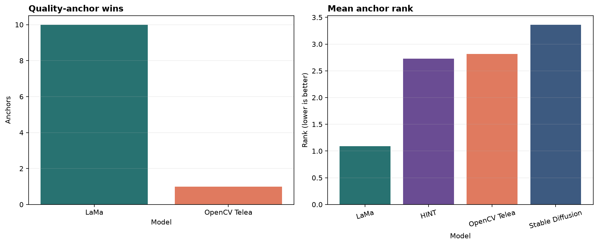

# Trustworthy Evaluation Frameworks for AI-Assisted Painting Restoration

**A restoration can look convincing and still be wrong. How should we evaluate it?**

This master's thesis develops and applies an evidence-based evaluation framework for AI-assisted painting restoration. It combines controlled artificial damage, complementary inpainting methods, region-aware measurements, robustness experiments, repeated-candidate disagreement and inspectable case-level evidence.

The contribution is an **evaluation framework and reproducible empirical study**, not a newly trained restoration model or an automated conservation system.

[Explore the dashboard](https://fhtw-painting-restoration-main.streamlit.app/) · [Final evaluation report](outputs/33_final_evaluation_report/reports/final_evaluation.html) · [Supervisor walkthrough](docs/supervisor/Supervisor_Dashboard_Walkthrough_Controlled_300.pdf) · [Completion and review brief](docs/supervisor/Study_Completion_and_Review_Brief.pdf)

> Visual plausibility, metric performance and output stability are different kinds of evidence. None alone establishes historical correctness or conservation approval.

## The study in one minute

The completed **Controlled-300** study uses 300 paintings, balanced across five broad visual categories. Artificial damage creates known-reference comparisons: the original image is available, so a restoration can be inspected against the content it was meant to recover.

Four methods have full eligible-case coverage: **OpenCV Telea, LaMa, HINT and Stable Diffusion**. SDXL is reported separately as a bounded feasibility branch.

The main comparative finding is clear but conditional: **LaMa leads 10 of 11 saved quality anchors; Telea leads crop SSIM.** An anchor is one metric in one defined image region, not a component of a universal combined score. Zero anchor wins do not mean a method never performs well on an individual painting.



The framework preserves disagreement between measurements and connects aggregate results to exact candidates, diagnostic maps, limitations and source records. The [final supervisor synthesis](outputs/36_supervisor_publication_reproducibility_package/reports/supervisor_summary.md) pairs the principal claims with their evidence and limits.

## Research questions and final answers

### RQ1 — What does richer evaluation reveal?

**What additional evidence does a region-aware, multi-metric evaluation framework provide beyond traditional image-similarity metrics when evaluating AI-assisted painting restoration?**

Complementary measurements expose disagreements that a single similarity score conceals. Pixel fidelity, perceptual similarity, local colour/texture consistency, boundary behaviour and structural diagnostics answer different questions. Inspecting the damaged region, its crop, the boundary and surrounding content prevents unchanged background pixels from dominating the interpretation.

The LaMa/Telea anchor split illustrates why metric choice matters. Region and metric ablations make that dependence explicit. **The evidence supports multi-metric review, not a universal trustworthiness score.**

[Metric disagreement](outputs/21_multi_model_comparison/reports/multi_model_comparison.html) · [Metric/region ablation](outputs/28_metric_and_region_policy_ablation/reports/ablation_study.html)

### RQ2 — How do the methods compare?

**How do selected inpainting methods differ in restoration quality across controlled artificial damage conditions, and how consistent are these differences across the evaluated paintings?**

LaMa is the strongest general baseline across the saved quality anchors in this benchmark, while Telea leads crop SSIM. HINT supplies a second full-scope deterministic learned method, and Stable Diffusion supplies stochastic restoration and prompt/seed comparisons. Damage-size, mask-geometry and degradation analyses retain their own populations and conditions rather than collapsing robustness into a single number.

**These are controlled-benchmark conclusions, not universal model rankings.** Case-level variation remains relevant; paintings, not repeated candidates from one painting, are the independent units. The broad categories do not independently establish art-historical style effects. SDXL's partial scope does not support a full-benchmark rank.

[Model comparison](outputs/21_multi_model_comparison/reports/multi_model_comparison.html) · [Grouped statistical analysis](outputs/26_grouped_and_statistical_analysis/reports/statistical_analysis.html)

### RQ3 — What does repeated-output disagreement tell us?

**How can repeated-candidate disagreement be used to characterize the stability of stochastic painting restorations, and how does it relate to other restoration-quality diagnostics?**

Stable Diffusion provides **1,025 supported four-seed groups**: 780 canonical prompt-specific groups and 245 damage-size groups. Their scalar and spatial disagreement reveals where outputs vary and gives reviewers another diagnostic to inspect alongside fidelity and local-consistency evidence.

**Variation is not calibrated confidence.** A stable reconstruction can still be incorrect; an unstable region is a reason to inspect, not proof of failure. Prompt conditions remain separate so prompt changes are not mistaken for seed variability. Deterministic methods are assessed through sensitivity and robustness, not invented seed uncertainty.

[Saved RQ answers and source-row identities](outputs/36_supervisor_publication_reproducibility_package/data/key_findings.json) · [Final evidence tables](outputs/33_final_evaluation_report/data/thesis_tables.csv)

## What was evaluated?

| Population | Completed scope | Meaning |
|---|---:|---|
| Paintings | 300 | 60 in each of five broad visual categories |
| Registered cases | 3,425 | Includes conditions not treated as inpainting |
| Restoration-eligible cases | 2,620 | 2,320 nonzero-damage cases plus 300 identity controls |
| Matched primary candidates | 10,480 | Four full methods across the eligible cases |
| Retained report candidates | 13,879 | Primary, repeated-seed, prompt and bounded SDXL evidence; not all execution records |
| Supported uncertainty groups | 1,025 | Four seeds per group, not 1,025 independent paintings |
| SDXL branch | 24 completed / 35 scheduled | Partial feasibility evidence, not a fifth full-coverage method |

The five categories are portrait/figure, landscape/natural, architecture/structured, abstraction/surrealism and high-texture/brushwork. They are operational visual groupings, not independently verified style labels.

| Experiment | Registered cases | Design |
|---|---:|---|
| Canonical damage | 1,500 | 300 paintings × four damage types and one undamaged control |
| Damage-size sensitivity | 245 | 35 paintings × seven target damage levels, from 2% to 20% |
| Mask robustness | 525 | 35 paintings × 15 controlled mask conditions |
| Synthetic degradation | 1,155 | 35 paintings × 33 conditions; only eligible effects enter restoration comparisons |

The retained catalogue is an analysis population, **not a quality-approval list**. Missing measurements remain missing; a candidate never inherits another candidate's score. Detailed design and independence rules are in the [methodology notes](docs/methodology_notes.md).

### Separate studies: method selection and focused portrait review

**D01 / Notebook 37** compared HINT and MAT on 12 paired cases before expansion. HINT led 96 of 108 case-level metric anchors; MAT led six, with six ties. HINT was selected and subsequently evaluated across all 2,620 eligible cases in N12A. The 24 D01 candidates remain separate selection evidence, not part of the main leaderboard. [Selection report](outputs/37_hint_mat_method_selection/reports/method_selection_report.html).

**D02** is a separate focused portrait audit, accessible through Trustworthiness. Its matched evidence found hands harder to restore, while rendered lightness did not show a consistent overall association. Rendered lightness is not race or identity, and this is not a demographic-bias certification. The [final synthesis](outputs/36_supervisor_publication_reproducibility_package/reports/supervisor_summary.md) preserves these boundaries.

## Explore the evidence, not just the headline

The [Streamlit dashboard](https://fhtw-painting-restoration-main.streamlit.app/) is an eight-room interactive museum. Start with **Take the guided tour (about 6 min)** in the Exhibition Foyer, or use **Explore freely** to choose a question-led entry point.

| Room | What to inspect |
|---|---|
| Exhibition Foyer | The central question and guided route |
| Study Design | Population, experimental conditions and eligibility |
| Metric Framework | What each measurement and region can tell you |
| Model Gallery | Method-specific results, capabilities and limitations |
| Stability Lab | Sensitivity, perturbations and repeated-seed evidence |
| Trustworthiness | Computational review flags; optional D02 portrait side room |
| Case Explorer | One exact painting, case and candidate: images, maps and saved measurements |
| Research Archive | Reports, provenance, manifests, checksums and study limits |

The dashboard reads saved evidence. **It does not run restoration models or recompute scientific metrics.** Computational flags guide attention; they are not expert annotations or probabilities of failure.

The report collection covers 30 selected cases and all 300 paintings. [Pinned case/painting report package on HF](https://huggingface.co/datasets/RahulMaddineni264/painting-restoration-eval-diagnostics/blob/c33bbd87e65fe96f9a81c1c794fd4a70f7226874/report_packages/v1/controlled_300/32_case_and_painting_report_generation/run_0d4ae193602944dda511bf54199105b1/reports/index.html).

GitHub displays HTML source rather than the full report presentation. Download a report and open it locally, or open it through the dashboard. Scientific report images are embedded for standalone viewing.

## Reproducibility and delivery status

**Completed:** N01–N36, including N12A, with separate D01 and supplemental D02. The Controlled-300 dashboard is deployed from `main`; its approved layout is frozen. The pilot baseline remains recoverable at `pilot-50-complete`.

N36 closed with **859 passed checks, 16 disclosed warning nonpasses and zero blockers**. The complete delivery has **134 files**, including a **123-file review package** containing six scientific HTML reports, 24 figures, five model cards, compact tables and 38 upstream manifests. Its 693-row artifact index distinguishes copied, generated and intentionally unbundled evidence.

Start with the [package README](outputs/36_supervisor_publication_reproducibility_package/package/README.md), [reproducibility appendix](outputs/36_supervisor_publication_reproducibility_package/reports/reproducibility_appendix.md) and [limitations record](outputs/36_supervisor_publication_reproducibility_package/reports/limitations_and_deviations.md). Distribute the **complete N36 output directory**, not `package/` alone. It is a review package, not a runnable clone of the full research environment.

Compact records and code live in GitHub; bulk restoration/diagnostic evidence follows the checksum-pinned GitHub/HF routes recorded in the publication manifests. N36's bounded delivery is ordinary Git, without LFS or a duplicate HF release. A Zenodo deposit remains planned, not completed.

The 16 N36 nonpasses retain N35's four dependency warnings and ten unmeasured, owner-accepted qualifications, plus the N29 historical-manifest and N35 notebook-source discrepancies. Availability checks and owner acceptance do not establish exhaustive browser coverage, performance budgets, a fresh clean-Linux reproduction or an independently attested deployed-server revision. [Full closeout audit](docs/evidence_dependency_audit.md#n36-controlled-300-closeout--2026-10-01).

## Run the dashboard locally

Use Python 3.12 and Git LFS for the repository's retained LFS-managed assets:

```powershell
git lfs install
git clone https://github.com/Rahul-DS25M008/painting_restoration_eval.git
cd painting_restoration_eval
git lfs pull

py -3.12 -m venv .venv
.\.venv\Scripts\Activate.ps1
python -m pip install -r requirements.txt
python -m streamlit run streamlit_app.py
```

Dashboard use does not require a GPU. Lazy remote evidence needs network access. Full experimental reproduction needs the separate experiment environments, datasets and model prerequisites recorded in the appendix; installing the dashboard requirements alone is not a full reproduction.

## Find your way around the repository

- `notebooks/` — completed producers, analyses and delivery stages; [roadmap](docs/final_notebook_roadmap.md).
- `src/restoration_eval/` — reusable scientific and dashboard implementation.
- `config/` — versioned experimental, evaluation and publication contracts.
- `outputs/` — notebook-owned evidence, reports, manifests and validation; copied package files are intentional provenance, not redundant clutter.
- `streamlit_assets/` — deployed presentation assets and evidence indexes.
- `tests/` and `tools/` — regression checks, validation, inventory and publication utilities; completed-notebook helpers may still be required for reproducibility.
- `docs/` — [methods](docs/methodology_notes.md), [literature](docs/literature_reference_log.md), [evidence audit](docs/evidence_dependency_audit.md), [defence preparation](docs/notebook_revision_and_defence_qa.md) and supervisor material.

## What the thesis does not claim

The experiments simulate damage; they do not validate physical conservation treatments. Reference fidelity and feature similarity do not establish authenticity. Repeated-seed disagreement is not calibrated uncertainty. Review flags are not expert judgements. SDXL remains partial, and the separate D01/D02 studies do not justify universal model superiority or demographic conclusions.

**The final contribution is a traceable way to ask better questions of a restoration: what changed, what was measured, how stable is it, and what evidence still requires human judgement?**
