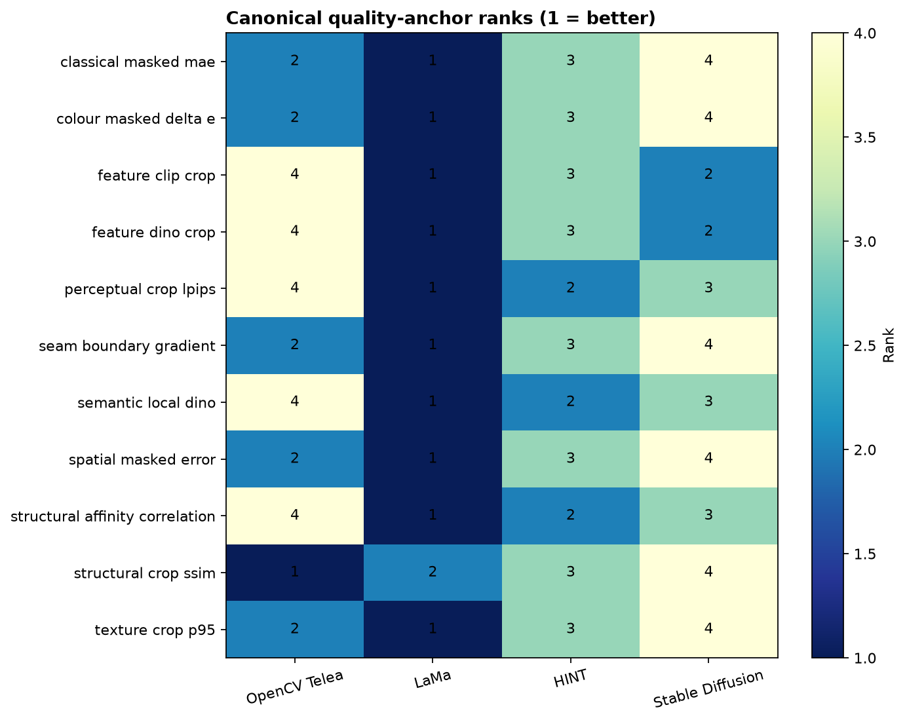
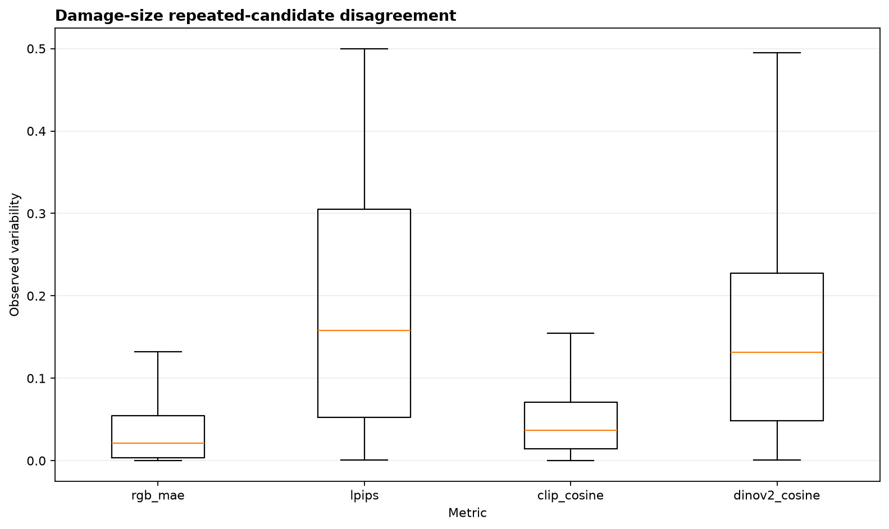

# Controlled-300: supervisor review summary

## Decision snapshot

The evidence supports a region-aware, multi-metric evaluation workflow—not a
universal restoration score or conservation approval. **LaMa leads 10 of 11
saved quality anchors; Telea leads crop SSIM.** This is bounded comparative
evidence, not universal model superiority.

The collection contains **300 paintings**,
**3,425 registered cases** and
**2,620 restoration-eligible cases**.
The matched four-method comparison has **10,480
primary candidates**. The broader retained report population contains
**13,879 candidates**; it is not the same
denominator as all model executions.

## Model coverage

| model_id | evaluation_status | scheduled cases | completed executions | saved anchor wins |
| --- | --- | --- | --- | --- |
| opencv_telea | fully_evaluated | 2620 | 2620 | 1.0 |
| lama | fully_evaluated | 2620 | 2620 | 10.0 |
| hint_places2 | fully_evaluated | 2620 | 2620 | 0.0 |
| stable_diffusion_inpainting | fully_evaluated | 2620 | 8520 | 0.0 |
| sdxl_inpainting | partial_evaluation | 35 | 24 | not applicable |

Four methods have full coverage: Telea, LaMa, HINT and Stable Diffusion.
SDXL has **24 completed candidates from a bounded 35-case schedule**.
Its other 11 scheduled records include timeout/skipped outcomes, not 11
demonstrated inference crashes. SDXL has no full-benchmark anchor rank.
Zero anchor wins do not mean a method never performs well on individual cases.

D01 is separate 12-case HINT/MAT selection evidence; D02 is a separate focused
portrait audit. Neither is pooled into the main benchmark.

## Research questions

### RQ1

What additional evidence does a region-aware, multi-metric evaluation framework provide beyond traditional image-similarity metrics when evaluating AI-assisted painting restoration?

**Answer:** Complementary region-aware metrics expose disagreements; no single or combined score establishes restoration trustworthiness.

**Boundary:** Metrics and feature similarity are not conservation approval.

Trace: 34 saved rows in [thesis tables](../package/tables/thesis_tables.csv).

### RQ2

How do selected inpainting methods differ in restoration quality across controlled artificial damage conditions, and how consistent are these differences across the evaluated paintings?

**Answer:** LaMa leads 10 of 11 saved quality anchors and Telea leads crop SSIM. HINT is a full deterministic method; SDXL remains bounded. Conclusions apply to this controlled benchmark.

**Boundary:** No universal model superiority or independently established art-historical style effect.

Trace: 49 saved rows in [thesis tables](../package/tables/thesis_tables.csv).

### RQ3

How can repeated-candidate disagreement be used to characterize the stability of stochastic painting restorations, and how does it relate to other restoration-quality diagnostics?

**Answer:** The 780 canonical and 245 damage-size groups characterize repeated-seed variation. Disagreement supports inspection, not calibrated confidence or historical correctness.

**Boundary:** Only supported repeated-seed groups; deterministic methods do not acquire seed uncertainty.

Trace: 8 saved rows in [thesis tables](../package/tables/thesis_tables.csv).

## Principal evidence

### Balanced controlled collection

The collection contains 300 paintings, with 60 in each of five broad visual categories.

**Limit:** This does not represent every artistic tradition, period or conservation condition.

### Matched four-method evidence

The four full-scope methods were compared on 2,620 eligible cases, producing 10,480 primary candidates.

**Limit:** Eligibility and metric performance do not establish historical correctness.

### Different measurements can prefer different methods

LaMa led 10 of 11 separate quality anchors; Telea led crop SSIM.

**Limit:** No combined or universal quality score was created.

### Repeated outputs reveal variation

Stable Diffusion has 1,025 supported four-seed groups covering 4,100 candidate memberships.

**Limit:** This is empirical variation, not calibrated confidence.

### Flags organize review rather than replace it

Operational thresholds point to evidence that deserves closer inspection.

**Limit:** A flag is not a probability, expert verdict or conservation decision.

### The focused portrait audit remains separate

D02 found hands harder to restore in its matched audit, while rendered lightness did not show a consistent overall association.

**Limit:** Rendered lightness is not race or identity, and the audit does not establish demographic bias.

## Robustness, trustworthiness and explanation

Damage-size, mask-geometry and synthetic-degradation evidence must retain their
own conditions and denominators. The extension populations do not independently
separate painting identity from category. Inspect the saved condition-specific
results rather than treating one mean as universal robustness.

Repeated-seed evidence comprises 780 canonical and 245 damage-size groups.
It describes variability, not calibrated confidence. Computational flags,
threshold sensitivity, counterfactual views and retrieval neighbours support
inspection; they are not expert truth or proof of historical correctness.

## Delivery and reproducibility

[Open the full evaluation](../package/reports/final_evaluation.html) for the
complete scientific narrative and embedded evidence.
[Open the deployed dashboard](https://fhtw-painting-restoration-main.streamlit.app/) for exploration.

N35 closed with **519 passes, 14 warning nonpasses and zero blocking failures**.
Four warnings concern dependencies; ten are unmeasured, owner-accepted
qualifications. Successful availability checks do not establish p95 latency,
peak memory, exhaustive browser coverage or clean Linux reproduction.
The deployed server revision was not independently attested.

The N29 historical manifest discrepancy and N35 notebook-source mismatch remain
disclosed. See the [limitations](../package/reports/limitations_and_deviations.md)
and [reproducibility appendix](../package/reports/reproducibility_appendix.md).
This bundle is not a runnable repository clone.

## Decisions requested

1. Confirm that the bounded research-question answers are suitable for the thesis.
2. Choose the principal figures and representative cases for the final narrative.
3. Agree how prominently to present SDXL feasibility and the separate D01/D02 studies.
4. Review the limitations and decide whether any additional expert study is future work.
5. Approve the publication/freeze plan without treating planned publication as completed.

Visual plausibility is not historical correctness or conservation approval.
