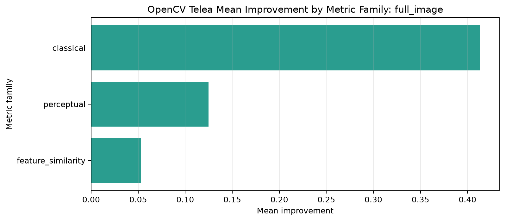
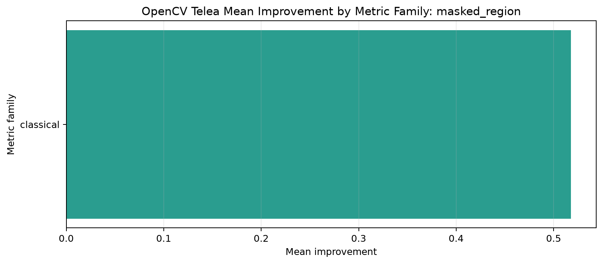
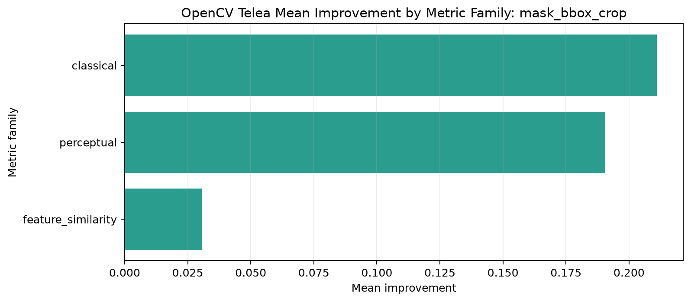
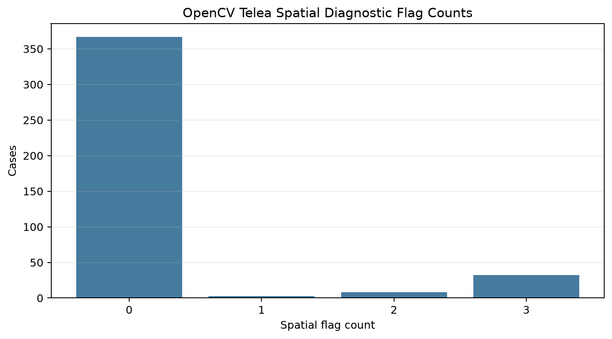
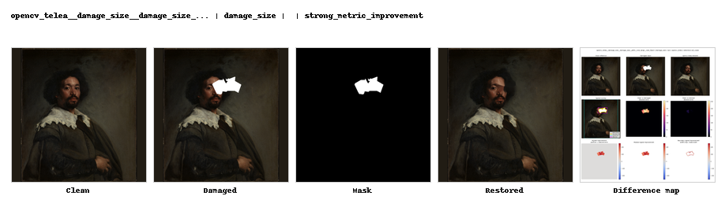
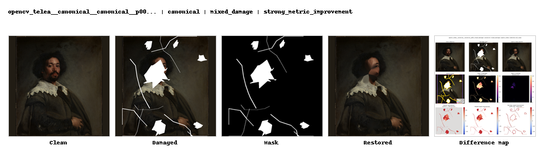

# OpenCV Telea Restoration Evaluation Report

Generated: 2026-07-27 15:02:00

## 1. Report Purpose

This report consolidates the OpenCV Telea baseline evidence produced by the current evaluation pipeline. It is deliberately written as a diagnostic report, not as a final thesis conclusion. The goal is to make the OpenCV results inspectable before cross-model comparison with LaMa, Stable Diffusion Inpainting, and SDXL Inpainting.

Notebook 13 was planned to do eight things:

| planned_report_item | available_in_batch | report_handling |
| --- | --- | --- |
| consolidate_opencv_metrics | 1 | Included through case-level metric table references plus dataset, mask-type, and region summaries. |
| runtime_and_failure_information | 1 | Included as a dedicated runtime and failure section. |
| region_aware_results | 1 | Included as a dedicated region-aware metric section. |
| difference_maps | 1 | Included through figure manifest and representative-case panels. |
| representative_cases | 1 | Included as a table plus embedded representative panels. |
| texture_colour_seam_evidence | 0 | Included when columns exist; otherwise explicitly marked as unavailable/preliminary. |
| standardized_report_assets | 1 | Included through report figure manifest, representative manifest, and Batch 5 asset index. |
| avoid_final_trustworthiness_conclusion | 1 | Handled through a dedicated interpretation caveat and next-step section. |

The important point is that every planned item is now either represented in the report or explicitly marked as unavailable. This prevents the report from claiming evidence that has not actually been generated yet.

## 2. Evaluation Scope

The current OpenCV report contains:

- Total unique report cases: 410
- Zero-control cases: 50
- Nonzero damaged cases: 360
- Cases with difference maps: 410
- Datasets represented: canonical, damage_size, mask_robustness, synthetic_degradation
- Mask types represented: , loss_large, loss_small, mixed_damage, scratch_thin, zero_control
- Metric families represented: classical, feature_similarity, perceptual
- Regions represented: boundary_region, content_region, full_image, mask_bbox_crop, masked_region, outside_mask_region

The zero-control cases are included to check whether the reporting and metric pipeline behaves sensibly when no synthetic damage is applied. The nonzero damaged cases are the main restoration-evaluation cases.

## 3. Method Summary

OpenCV Telea is used here as a deterministic classical inpainting baseline. It fills masked areas using nearby image information rather than learning semantic content from a training dataset. This makes it useful as a baseline because it is reproducible, fast, and explainable, but it also means it is not expected to reconstruct historically plausible missing content when the damaged region is large or semantically important.

The report combines several evidence families:

- Classical image metrics such as MSE, MAE, PSNR, and SSIM.
- Perceptual evidence such as LPIPS when available.
- Feature-similarity evidence such as CLIP, DINOv2, or mean feature similarity when available.
- Region-aware evidence comparing full image, masked area, bounding-box, content, and other available regions.
- Spatial diagnostic flags that identify cases where improvement is uneven or potentially misleading.
- Difference-map figures and representative panels for visual inspection.

These measures are complementary. A case can improve in pixel error while still looking structurally wrong. A case can look locally smooth while losing brush texture. A case can improve inside the mask while introducing boundary artifacts. This is why the report does not reduce restoration quality to one score.

## 4. Metric Interpretation Policy

The report uses improvement values where possible. Positive improvement usually means that the restored image moved closer to the clean reference than the damaged image did.

Metric direction still matters:

- clip: Higher values are better, so positive improvement means the restoration moved closer to the clean reference.
- dinov2: Higher values are better, so positive improvement means the restoration moved closer to the clean reference.
- lpips: Lower values are better, so positive improvement means the restoration reduced error relative to the damaged input.
- mae: Lower values are better, so positive improvement means the restoration reduced error relative to the damaged input.
- mean_feature_similarity: Higher values are better, so positive improvement means the restoration moved closer to the clean reference.
- mse: Lower values are better, so positive improvement means the restoration reduced error relative to the damaged input.
- psnr: Higher values are better, so positive improvement means the restoration moved closer to the clean reference.
- ssim: Higher values are better, so positive improvement means the restoration moved closer to the clean reference.

The region is also important. Full-image metrics can hide poor restoration if the mask is small. Masked-region and mask-bounding-box metrics are more sensitive to the damaged area. Outside-mask checks are useful for identifying unintended changes beyond the region that should have been edited.

## 5. Dataset-Level Results

This section groups results by dataset/source label. It helps check whether OpenCV Telea behaves similarly across the image sources used in the experiment.

| report_dataset_name | cases | nonzero_cases | difference_map_cases | mean_spatial_flag_count | cases_with_spatial_flags |
| --- | --- | --- | --- | --- | --- |
| ('canonical',) | 250 | 200 | 250 | 0.0000 | 0 |
| ('damage_size',) | 35 | 35 | 35 | 0.0000 | 0 |
| ('mask_robustness',) | 75 | 75 | 75 | 0.0000 | 0 |
| ('synthetic_degradation',) | 50 | 50 | 50 | 2.3000 | 43 |

Dataset-level numbers should be interpreted as broad diagnostics. If one dataset appears weaker, that may reflect different painting styles, texture density, colour distributions, mask placement, or source-image properties. It should not immediately be interpreted as model bias without inspecting the case-level evidence.

## 6. Mask-Type Results

This section groups results by synthetic damage type. It is one of the most important parts of the OpenCV baseline because Telea is expected to behave very differently on thin scratches versus larger missing regions.

| report_mask_type | cases | nonzero_cases | difference_map_cases | mean_spatial_flag_count | cases_with_spatial_flags |
| --- | --- | --- | --- | --- | --- |
| ('',) | 160 | 160 | 160 | 0.7188 | 43 |
| ('loss_large',) | 50 | 50 | 50 | 0.0000 | 0 |
| ('loss_small',) | 50 | 50 | 50 | 0.0000 | 0 |
| ('mixed_damage',) | 50 | 50 | 50 | 0.0000 | 0 |
| ('scratch_thin',) | 50 | 50 | 50 | 0.0000 | 0 |
| ('zero_control',) | 50 | 0 | 50 | 0.0000 | 0 |

For OpenCV Telea, strong performance on small or thin masks would be expected because the method can interpolate nearby colours and structures. Weaker performance on large-loss and mixed-damage masks would also be expected because those cases require more semantic reconstruction and longer-range structure recovery.

## 7. Region-Aware Results

Region-aware reporting is necessary because whole-image averages can be misleading. If a mask covers only a small percentage of the painting, a high full-image SSIM can coexist with a visibly poor restoration inside the damaged region.

| metric_family | metric_name | report_region | rows | cases | mean_improvement | median_improvement | positive_rate | negative_rate |
| --- | --- | --- | --- | --- | --- | --- | --- | --- |
| classical | mae | boundary_region | 355 | 355 | -11.9407 | -13.1288 | 0.2282 | 0.7718 |
| classical | mae | content_region | 410 | 410 | -2.1574 | -1.0072 | 0.1781 | 0.6878 |
| classical | mae | full_image | 410 | 410 | -1.6774 | -0.7510 | 0.1781 | 0.6878 |
| classical | mae | mask_bbox_crop | 355 | 355 | -8.0149 | -2.4898 | 0.2056 | 0.7944 |
| classical | mae | masked_region | 355 | 355 | -39.3973 | -38.2746 | 0.2056 | 0.7944 |
| classical | mae | outside_mask_region | 410 | 410 | 0.0000 | 0.0000 | 0.0000 | 0.0000 |
| classical | mse | boundary_region | 355 | 355 | 22.7698 | 24.3949 | 0.8901 | 0.1099 |
| classical | mse | content_region | 410 | 410 | 2.1018 | 1.7853 | 0.7634 | 0.1024 |
| classical | mse | full_image | 410 | 410 | 1.6122 | 1.3541 | 0.7634 | 0.1024 |
| classical | mse | mask_bbox_crop | 355 | 355 | 6.8437 | 3.6723 | 0.8817 | 0.1183 |
| classical | mse | masked_region | 355 | 355 | 39.1298 | 41.1616 | 0.8817 | 0.1183 |
| classical | mse | outside_mask_region | 410 | 410 | 0.0000 | 0.0000 | 0.0000 | 0.0000 |
| classical | psnr | boundary_region | 355 | 355 | 3.2861 | 3.8256 | 0.8901 | 0.1099 |
| classical | psnr | content_region | 410 | 410 | 1.6954 | 1.7908 | 0.7634 | 0.1024 |
| classical | psnr | full_image | 410 | 410 | 1.6954 | 1.7908 | 0.7634 | 0.1024 |
| classical | psnr | mask_bbox_crop | 355 | 355 | 1.9456 | 2.1139 | 0.8817 | 0.1183 |
| classical | psnr | masked_region | 355 | 355 | 1.8210 | 2.1139 | 0.8817 | 0.1183 |
| classical | psnr | outside_mask_region | 410 | 410 | 0.0000 | 0.0000 | 0.0000 | 0.0000 |
| classical | ssim | content_region | 410 | 410 | 0.0288 | 0.0282 | 0.7561 | 0.1098 |
| classical | ssim | full_image | 410 | 410 | 0.0225 | 0.0211 | 0.7561 | 0.1098 |
| classical | ssim | mask_bbox_crop | 355 | 355 | 0.0694 | 0.0649 | 0.8732 | 0.1268 |
| feature_similarity | clip | content_region | 410 | 410 | 0.0679 | 0.0748 | 0.7488 | 0.1171 |
| feature_similarity | clip | full_image | 410 | 410 | 0.0634 | 0.0677 | 0.7390 | 0.1268 |
| feature_similarity | clip | mask_bbox_crop | 355 | 355 | 0.0711 | 0.0811 | 0.8254 | 0.1746 |
| feature_similarity | dinov2 | content_region | 410 | 410 | 0.0226 | 0.0090 | 0.5488 | 0.3171 |
| feature_similarity | dinov2 | full_image | 410 | 410 | 0.0423 | 0.0186 | 0.5732 | 0.2927 |
| feature_similarity | dinov2 | mask_bbox_crop | 355 | 355 | -0.0099 | 0.0258 | 0.5916 | 0.4084 |
| feature_similarity | mean_feature_similarity | content_region | 410 | 410 | 0.0453 | 0.0442 | 0.6610 | 0.2049 |
| feature_similarity | mean_feature_similarity | full_image | 410 | 410 | 0.0528 | 0.0450 | 0.6537 | 0.2122 |
| feature_similarity | mean_feature_similarity | mask_bbox_crop | 355 | 355 | 0.0306 | 0.0543 | 0.6225 | 0.3775 |
| perceptual | lpips | content_region | 410 | 410 | 0.1420 | 0.1197 | 0.7561 | 0.1098 |
| perceptual | lpips | full_image | 410 | 410 | 0.1249 | 0.1013 | 0.7561 | 0.1098 |
| perceptual | lpips | mask_bbox_crop | 355 | 355 | 0.1905 | 0.2049 | 0.8732 | 0.1268 |

The most thesis-relevant comparisons are usually:

- Full image versus masked region.
- Masked region versus mask bounding box.
- Inside-mask improvement versus outside-mask stability.
- Classical metric improvement versus perceptual or feature-space improvement.

Cases where these disagree are especially important because they show why a trustworthy evaluation framework needs multiple metric families.

## 8. Runtime And Failure Evidence

Runtime and failure information is part of trustworthiness because a restoration method that silently fails, skips cases, or produces inconsistent outputs cannot be evaluated reliably.

| rows |
| --- |
| 410 |
| 2295 |
| 1175 |
| 1175 |
| 410 |

This section should be checked before interpreting metric results. If a stage has missing outputs, failures, or incomplete rows, the affected cases should be excluded from strong claims or clearly marked as incomplete.

## 9. Difference Maps And Spatial Evidence

Difference maps provide visual evidence for where the restoration changed the image and where error remains concentrated. They are especially useful for detecting boundary artifacts, poor local blending, and cases where global metrics look acceptable despite visible local failure.

_opencv report metric family full image_

_opencv report metric family content region_

_opencv report metric family masked region_

_opencv report metric family mask bbox crop_

_opencv report spatial flag counts_

_opencv report mean spatial flags by mask type_

The figures in this section should be read alongside the region-aware tables. A metric improvement inside the mask is more convincing when the difference map also shows reduced localized error without new boundary or outside-mask artifacts.

## 10. Texture, Colour, And Seam Evidence

Preliminary texture, colour, and seam evidence was requested in the Notebook 13 plan, but no matching texture, colour, color, seam, boundary, or spatial-flag columns were found in the current report case table. The report therefore records this as unavailable rather than inventing evidence.

This part is still preliminary for the OpenCV-only report. Texture, colour, and seam consistency become more important in the cross-model phase because diffusion models may produce visually plausible but historically or stylistically inconsistent completions. For OpenCV Telea, the expected risk is different: local smoothing, weak texture continuation, and visible transitions around larger masks.

## 11. Representative Cases

Representative cases are included to prevent the report from becoming purely numeric. They are selected to cover strong improvements, weak or negative behavior, spatial flags, and different mask types.

| report_case_id | report_dataset_name | report_painting_id | report_mask_type | selection_reason | representative_score | spatial_flag_count_numeric | representative_panel_path |
| --- | --- | --- | --- | --- | --- | --- | --- |
| opencv_telea__synthetic_degradation__synthetic_degradation__p001__water_stain__severe | synthetic_degradation | p001 |  | spatial_diagnostic_flag |  | 3 | D:\Masters\FH\Thesis\painting-restoration-eval\outputs\figures\opencv_report_generation\representative_cases\opencv_telea__opencv_telea_synthetic_degradation_synthetic_degradation_p001_water_stain_severe_representative_panel.png |
| opencv_telea__damage_size__damage_size__p001__loss_large__size_02pct | damage_size | p001 |  | strong_metric_improvement |  | 0 | D:\Masters\FH\Thesis\painting-restoration-eval\outputs\figures\opencv_report_generation\representative_cases\opencv_telea__opencv_telea_damage_size_damage_size_p001_loss_large_size_02pct_representative_panel.png |
| opencv_telea__canonical__canonical__p001_loss_large | canonical | p001 | loss_large | strong_metric_improvement |  | 0 | D:\Masters\FH\Thesis\painting-restoration-eval\outputs\figures\opencv_report_generation\representative_cases\opencv_telea__opencv_telea_canonical_canonical_p001_loss_large_representative_panel.png |
| opencv_telea__canonical__canonical__p001_loss_small | canonical | p001 | loss_small | strong_metric_improvement |  | 0 | D:\Masters\FH\Thesis\painting-restoration-eval\outputs\figures\opencv_report_generation\representative_cases\opencv_telea__opencv_telea_canonical_canonical_p001_loss_small_representative_panel.png |
| opencv_telea__canonical__canonical__p001_mixed_damage | canonical | p001 | mixed_damage | strong_metric_improvement |  | 0 | D:\Masters\FH\Thesis\painting-restoration-eval\outputs\figures\opencv_report_generation\representative_cases\opencv_telea__opencv_telea_canonical_canonical_p001_mixed_damage_representative_panel.png |
| opencv_telea__canonical__canonical__p001_scratch_thin | canonical | p001 | scratch_thin | strong_metric_improvement |  | 0 | D:\Masters\FH\Thesis\painting-restoration-eval\outputs\figures\opencv_report_generation\representative_cases\opencv_telea__opencv_telea_canonical_canonical_p001_scratch_thin_representative_panel.png |
| opencv_telea__canonical__canonical__p001_zero_control | canonical | p001 | zero_control | strong_metric_improvement |  | 0 | D:\Masters\FH\Thesis\painting-restoration-eval\outputs\figures\opencv_report_generation\representative_cases\opencv_telea__opencv_telea_canonical_canonical_p001_zero_control_representative_panel.png |

_opencv_telea__synthetic_degradation__synthetic_degradation__p001__water_stain__severe: spatial_diagnostic_flag_

_opencv_telea__damage_size__damage_size__p001__loss_large__size_02pct: strong_metric_improvement_

_opencv_telea__canonical__canonical__p001_loss_large: strong_metric_improvement_

_opencv_telea__canonical__canonical__p001_loss_small: strong_metric_improvement_

_opencv_telea__canonical__canonical__p001_mixed_damage: strong_metric_improvement_

_opencv_telea__canonical__canonical__p001_scratch_thin: strong_metric_improvement_

_opencv_telea__canonical__canonical__p001_zero_control: strong_metric_improvement_

These cases should be used as qualitative anchors. The table explains why the case was selected; the panel shows the clean image, damaged image, mask, restored image, and difference map where available.

## 12. Standardized Report Assets

The report generation step writes standardized assets so later notebooks and the Streamlit dashboard can reuse the same outputs.

| artifact_name | required | artifact_kind | path | exists | file_size_bytes | sha256 |
| --- | --- | --- | --- | --- | --- | --- |
| representative_case_manifest | 1 | file | outputs/reports/opencv_telea_report_representative_cases.csv | 1 | 5135.0000 | 85287a2bcb2f94cf8b63bc08ab77779a1a8942f820aee1b4c8e98b4dda6fc9cb |
| report_figure_manifest | 1 | file | outputs/reports/opencv_telea_report_figure_manifest.csv | 1 | 1359.0000 | a108a6261d4a51cd6fa4ceedefdd5d5d64cd503e97b76416ae5061d17381d712 |
| report_figure_dir | 1 | directory | outputs/figures/opencv_report_generation | 1 |  |  |
| representative_case_panel_dir | 1 | directory | outputs/figures/opencv_report_generation/representative_cases | 1 |  |  |

The asset manifest is important because it makes the report reproducible: every figure and representative panel should be traceable to a saved file path rather than existing only in notebook output.

## 13. What This Report Can And Cannot Claim

This report can support the following limited claims:

- The OpenCV Telea baseline has been evaluated using consolidated metrics.
- The results are broken down by dataset, mask type, and region where those labels are available.
- Difference maps and representative panels exist for visual inspection where the files were generated.
- Runtime and failure evidence has been collected where available.
- Preliminary spatial, texture, colour, or seam evidence is included only when matching columns exist.

This report cannot yet support final trustworthiness claims because it only covers the OpenCV Telea baseline. Trustworthiness in the thesis requires cross-model comparison, uncertainty evidence, damage-size sensitivity, metric ablation, and consistency checks across classical, perceptual, feature-space, and visual evidence.

## 14. Next Evaluation Step

The next step should reuse this exact report structure for LaMa, Stable Diffusion Inpainting, and SDXL Inpainting. Once those reports exist, the cross-model report can compare:

- Whether stronger perceptual metrics correspond to better visual restoration.
- Whether diffusion models improve semantic plausibility but introduce style or colour inconsistency.
- Whether uncertainty maps identify visibly risky restorations.
- Whether damage size changes model ranking.
- Whether seam and boundary artifacts are detected consistently.
- Whether metric ablation changes the interpretation of model quality.

Until that cross-model evidence is available, this OpenCV report should be treated as a baseline diagnostic and asset package.
